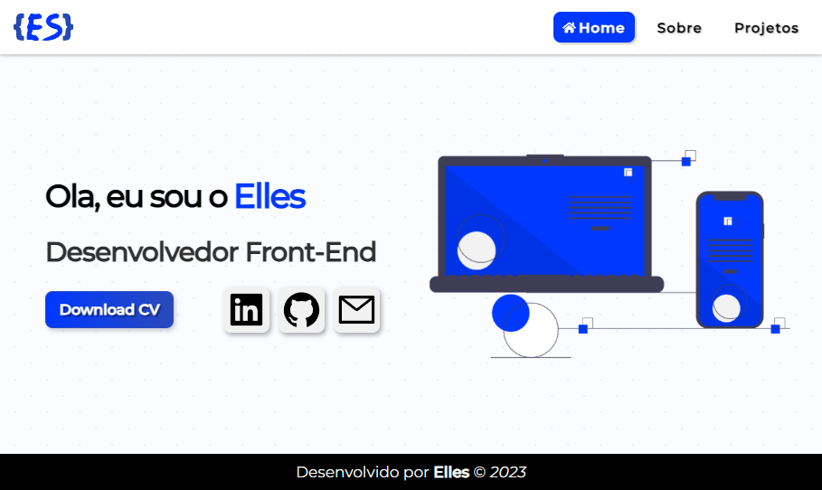

# Meu Portfolio

<h2 align="center">
    
</h2>

## About

<p align="left">Um webSite para guardar meus principais projetos/p>

<h2 align="left"><a href="https://portfolioelles.vercel.app/">See in Live</a></h2>

## 🛠 Tools

- [React](https://react.dev/)
- [TypeScript](https://www.typescriptlang.org/)
- [React-Query](https://tanstack.com/query/v3/docs/react/overview)
- [Styled-Components](https://styled-components.com/)

## 🚀 Getting Started

Download or clone this repository and run the project following commands inside the project folder.

```bash
# To Clone the project
git clone https://github.com/ellesLs/Meu-Portfolio.git
```

```bash
# 1.Install dependencies
npm install, yarn or pnpm install
```

```bash
# 2.Run the project
npm run dev, yarn dev or pnpm dev
```
