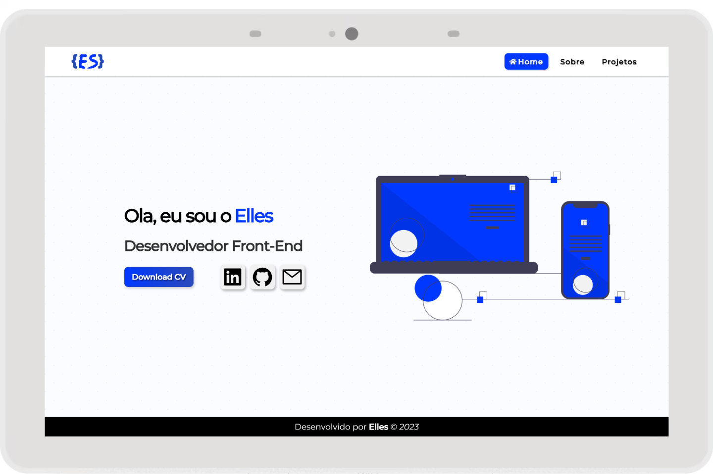

# Meu Portfolio

<h2 align="center">My personal website</h2>

<h3>🛠 Tools</h3>

- [React](https://react.dev/)
- [TypeScript](https://www.typescriptlang.org/)
- [Styled-Components](https://styled-components.com/)

<h3>🚀 Getting Started</h3>

Download or clone this repository and run this project following commands inside the project folder:

1. <code>npm install</code>, <code>yarn</code> or <code>pnpm install</code>;
2. <code>npm run dev</code>, <code>yarn dev</code> or  <code>pnpm dev</code>;
